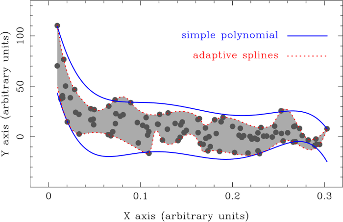

.. _contents:

.. boundfit documentation master file, created by
   sphinx-quickstart on Wed Dec 28 12:02:06 2016.
   You can adapt this file completely to your liking, but it should at least
   contain the root `toctree` directive.

Welcome to boundfit's documentation!
====================================

**Boundfit** determines upper and lower boundaries to a given data set using
the generalised least-squares method described in Data boundary fitting using a
generalised least-squares method (`Cardiel 2009, MNRAS, 396, 680
<http://cdsads.u-strasbg.fr/abs/2009MNRAS.396..680C>`_).

   Comparison between different functional forms for the boundary fitting.

   Example of pseudo-continuum fit using adaptive splines.

Document index:

.. toctree::
   :maxdepth: 2

   license_agreement
   installation
   program_description
   using_the_program
