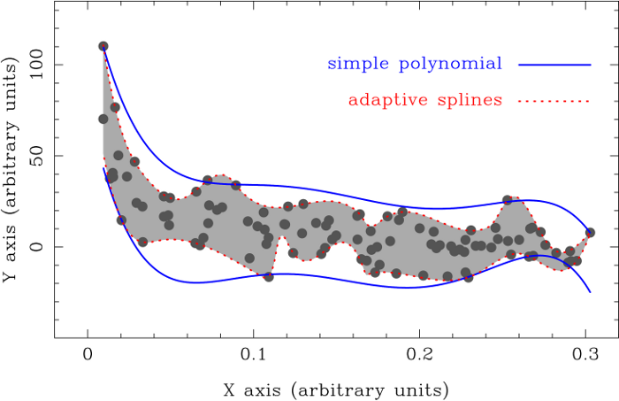

Program description
===================

**BoundFit** determines upper and lower boundaries to a given data set using
the generalised least-squares method described in Data boundary fitting using a
generalised least-squares method (`Cardiel 2009, MNRAS, 396, 680
<http://cdsads.u-strasbg.fr/abs/2009MNRAS.396..680C>`_; hereafter **C09**).

The key ideas behind this method are the following:

- The sought boundary is iteratively determined starting from an initial guess
  fit. Ordinary least-squares fits provide suitable starting points. At every
  iteration in the procedure a particular fit is always available.

- In each iteration the data to be fitted are segregated in two subgroups
  depending on their position relative to the particular fit at that iteration.
  In this sense, points are classified as being inside or outside of the
  boundary.

- Points located outside of the boundary are given an extra weight in the cost
  function to be minimised. This weight is parametrized through the asymmetry
  coefficient, which net effect is to generate a stronger pulling effect of the
  outer points over the fit, which in this way shifts towards the frontier
  delineated by the outer points as the iterations proceed.

- The minimisation of the cost function can be easily carried out using the
  popular DOWNHILL simplex method. In principle this allows the use of any
  complutable function as the analytical expression for the boundary fits.
  **BoundFit** incorporates the use of simple polynomials and adaptive splines
  as the two possible functional forms for the computed boundaries.

In the general case, given a set of :math:`N` data points :math:`(x_i,y_i)`,
with optional :math:`\sigma_i` uncertainties associated to the :math:`y_i`
data, the boundary to be fitted will be a function depending on :math:`(p+1)`
parameters :math:`a_0, a_1, a_2,\ldots a_p`, which values will be obtained by
the minimisation of

.. math::
   
   f(a_0,a_1,\ldots,a_p) =
   \sum_{i=1}^{N} w_i | y(x_i)-y_i |^\alpha,

where :math:`y(x_i)` is the boundary function evaluated at :math:`x_i`, and

.. math::
   
   w_i \equiv \left\{
   \begin{array}{ll}
   \begin{array}{@{}c@{}}\textrm{upper}\\ \textrm{boundary}\end{array} &
       \left\{ \begin{array}{ll}
                     1/\sigma_i^\beta & \textrm{for}\;\; y(x_i) \ge 
                       y_i - \tau \sigma_i\\
                   \xi/\sigma_i^\beta & \textrm{for}\;\; y(x_i) < 
                       y_i - \tau \sigma_i
        \end{array} \right. \\
                           & \\
   \begin{array}{@{}c@{}}\textrm{lower}\\ \textrm{boundary}\end{array} &
        \left\{ \begin{array}{ll}
                   \xi/\sigma_i^\beta & \textrm{for}\;\; y(x_i) > 
                       y_i + \tau \sigma_i \\
                     1/\sigma_i^\beta & \textrm{for}\;\; y(x_i) \le 
                       y_i + \tau \sigma_i
        \end{array} \right.
   \end{array}
   \right.

For the particular case :math:`\alpha=\beta=2`, :math:`\tau=0`, and
:math:`\xi=1` one gets the traditional cost function for the ordinary
least-squares fit

.. math::
   
   f(a_0,a_1,\ldots,a_p) =
   \sum_{i=1}^{N} \left( \frac{y(x_i)-y_i}{\sigma_i} \right)^2

The new method includes a set of tunable parameters :math:`\alpha, \beta, \tau`
and :math:`\xi`, which roles are basically the following:

- :math:`\alpha`: the power that controls how distances between the data points
  and the boundary fit are computed. Since this number its a real number, the
  difference :math:`y(x_i)-y_i` must be introduced in the first expression in
  absolute value.

- :math:`\beta`: the power for the error weighting. It has been defined as an
  additional parameter to have the possibility of using a value different from
  :math:`\alpha` (which in ordinary least-squares is set to 2).

- :math:`\xi`: this is the asymmetry coefficient, which is responsible for
  giving a different weight to the data points at both sides (inside and
  outside) of the boundary being fitted. For the method to work properly, a
  value of :math:`\xi > 1` must be employed.

- :math:`\tau`: cut-off parameter that allows some points to be left outside of
  the boundary fit. Since this parameter is used together with the data
  uncertainties σi, its use help to perform the computation of a boundary fit
  leaving the points with larger errors outside of the boundary.

A much more detailed description of this method, and the parameters
(:math:`\alpha`, :math:`\beta`, :math:`\tau` and :math:`\xi`) that can be tuned
to modify the behaviour of the fitting procedure depending on the nature of the
data being fitted, is given in **C09**.

Example
-------

The fits displayed in the following figure (Figure 6 from **C09**) have been
computed using option 1 "Simple polynomial (generic version)" and option 3
"Adaptive splines", which are explained below. The data points are those given
in the file :download:`example.dat<data/example.dat>`.

The following shell scripts can be used to reproduce the plotted boundary fits:

===================================  ==============  ============================================
type of fit                          boundary        script
===================================  ==============  ============================================
simple polynomial (generic version)  upper boundary  :download:`script1.csh<scripts/script1.csh>`
                                                     :download:`script1.sh<scripts/script1.sh>`
simple polynomial (generic version)  lower boundary  :download:`script2.csh<scripts/script2.csh>`
                                                     :download:`script1.sh<scripts/script2.sh>`
adaptive splines                     upper boundary  :download:`script2.csh<scripts/script3.csh>`
                                                     :download:`script1.sh<scripts/script3.sh>`
adaptive splines                     lower boundary  :download:`script2.csh<scripts/script4.csh>`
                                                     :download:`script1.sh<scripts/script4.sh>`
===================================  ==============  ============================================

Each of the different *scriptj.csh/.sh* files (with j=1, 2, 3 or 4) reads the ascii input file :download:`example.dat<data/example.dat>` and generates an ascii output file called *scriptj.out* containing a collection of 1000 points defining the corresponding boundary data.
